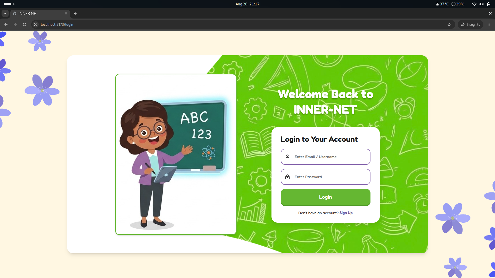
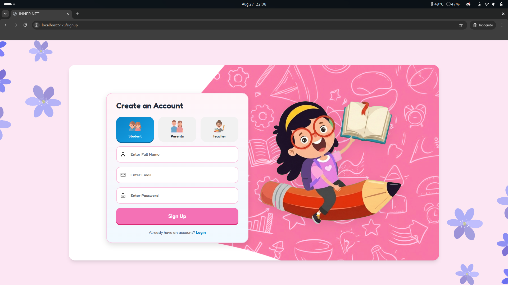

# INNER-NET

INNER-NET is an AI learning coach for children aged 8–12. It guides learners with small hints, asks them to explain their thinking, and helps them reach an answer independently.

## Included screens

- Login and role-based sign-up
- Personalized learner homepage
- Responsive learning chat connected to the Gemini backend
- New-chat flow, starter prompts, loading/error states, and learning completion status

## Run locally

### 1. Backend

```bash
cd backend
npm install
cp .env.example .env
npm run dev
```

Fill in `MONGO_URI`, `JWT_SECRET`, and `GEMINI_API_KEY` in `backend/.env` before starting the server.

### 2. Frontend

Open a second terminal:

```bash
cd frontend
npm install
cp .env.example .env
npm run dev
```

The frontend defaults to `http://localhost:3000` for the API. Change `VITE_API_URL` when the backend runs elsewhere.

## Production checks

```bash
cd frontend
npm run lint
npm run build
```

## Existing authentication screens




